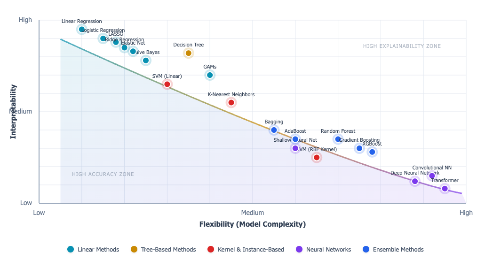

# Harvard-EPS-210

## Interactive Visualizations

### Click on each image to see the live interactive version:

---------------------------------------------------------
## Lecture 1: Eearthquake Impacts

<table>
  <tr align="center">
    <th>Flexibility vs Interpretability</th>
    <th> ... </th>
  </tr>
  
  <tr align="center">
    <td>
      
    </td>
    <td>
      
    </td>
  </tr>
</table>

---------------------------------------------------------
## Lecture 2: Geological Faults

<table>
  <tr align="center">
    <th>Fault types!</th>
    <th>Fault orientations (Strike, Dip, and Rake angles)!</th>
    <th>Mohr-Coulomb Failure!</th>
  </tr>
  
  <tr align="center">
    <td>
      
    </td>
    <td>
      
    </td>
    <td>
      
    </td>
  </tr>
</table>

  Increase principal stresses - try adjusting the sliders so the blue Mohr circle clearly crosses the red failure envelope. Watch the Mohr circle grow until it touches the failure line. You’ll see:

Change material properties - see how stronger materials (higher c, φ) resist failure

Compare different scenarios - weak vs. strong materials under various stress conditions

Understand the physics - why normal stress increases shear resistance

---------------------------------------------------------
