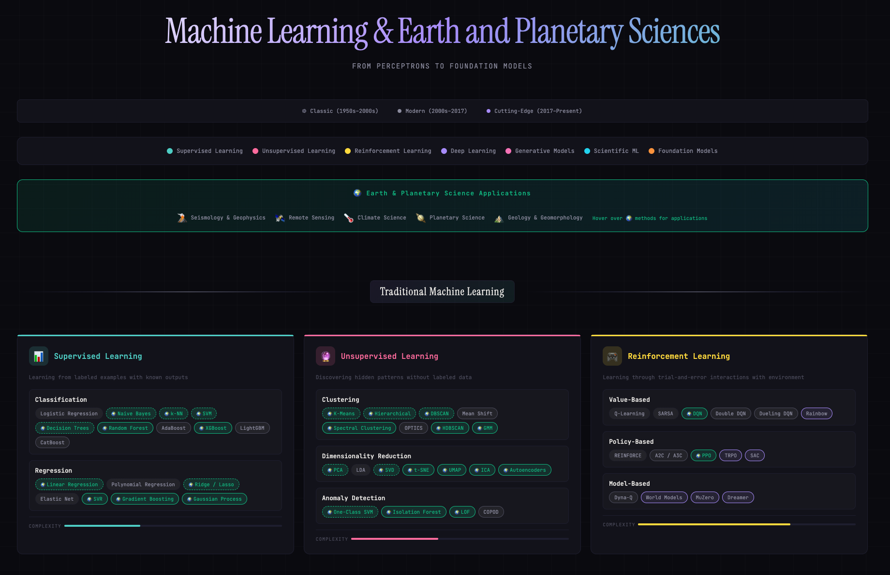
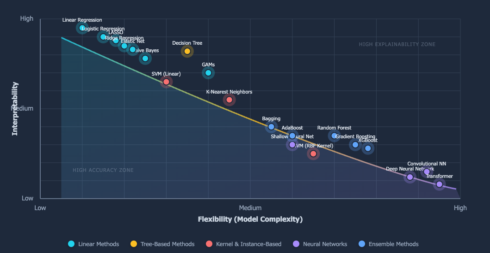
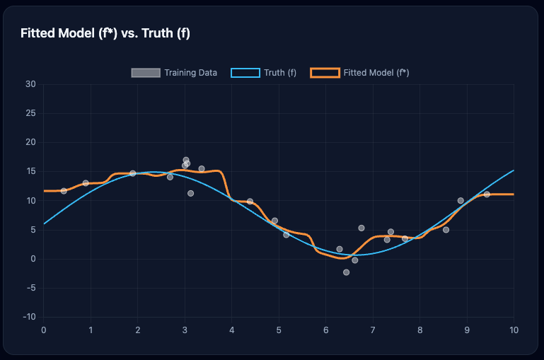
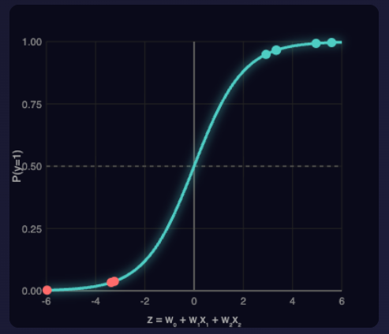
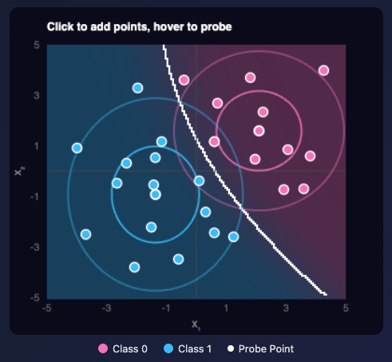
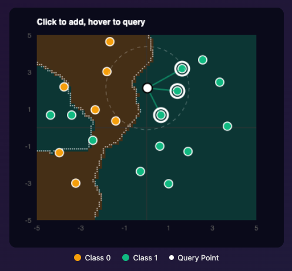
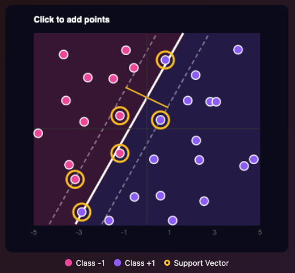
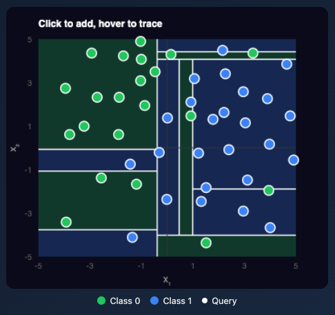
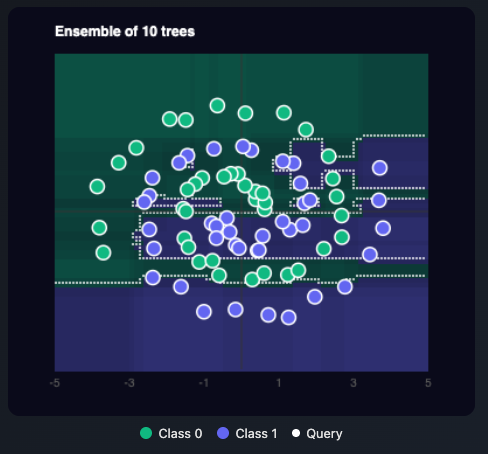
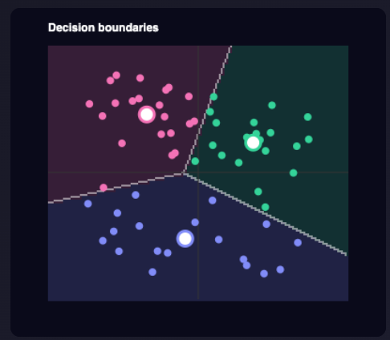

# Harvard-EPS-210

## Interactive Visualizations

### Click on each image to see the live interactive version:

---------------------------------------------------------
## Lecture 1:Intro to AI4EPS

<table>
  <tr align="center">
    <th>Machine Learning & Earth and Planetary Sciences</th>
  </tr>
  
  <tr align="center">
    <td>
      
    </td>
  </tr>
</table>

---------------------------------------------------------
## Lecture 3: Traditional Machine Learning (Statistical Learning) Methods I

<table>
  <tr align="center">
    <th>Flexibility vs Interpretability</th>
    <th>Bias-Variance Trade-Off</th>
    <th>Logistic Regression</th>
    <th>Naive Bayes</th>
  </tr>
  
  <tr align="center">
    <td>
      
    </td>
    <td>
      
    <td>
      
    </td>
    <td>
      
    </td>
  </tr>
</table>

<table>
  <tr align="center">
    <th>K-Nearest Neighbors</th>
    <th>Support Vector Machines</th>
    <th>Decision Trees</th>
    <th>Random Forest</th>
  </tr>
  
  <tr align="center">
    <td>
      
    </td>
    <td>
      
    </td>
    <td>
      
    </td>
    <td>
      
    </td>
  </tr>
</table>

---------------------------------------------------------

## Lecture 4: Traditional Machine Learning (Statistical Learning) Methods II

<table>
  <tr align="center">
    <th>K-Means Clustering</th>

  </tr>
  
  <tr align="center">
    <td>
      
    </td>
    <td>
      
    <td>
      
    </td>
    <td>
      
    </td>
  </tr>
</table>

<table>
  <tr align="center">
    <th>Support Vector Machines</th>
    <th>Decision Trees</th>
    <th>Random Forest</th>
  </tr>
  
  <tr align="center">
    <td>
      
    </td>
    <td>
      
    </td>
    <td>
      
    </td>
    <td>
      
    </td>
  </tr>
</table>
---------------------------------------------------------
